# Image Colorization

**Michigan Data Science Team**

**Winter 2023**

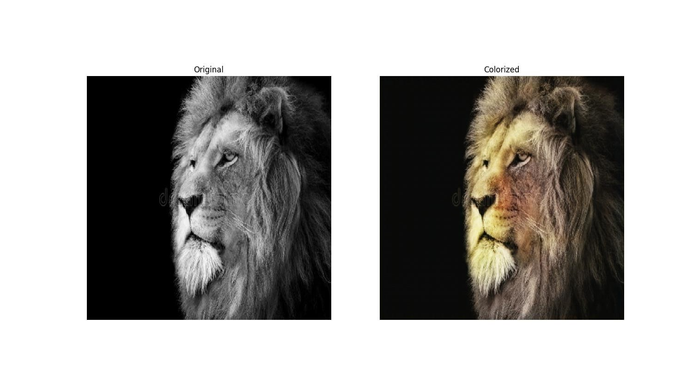

## Overview

Our project group studied using convolutional neural networks (CNNs) and generative adversarial networks (GANs) to turn black and white images into colored images.

## Files

```
.
├── CNN_Playground.ipynb
├── GUI.py
└── MNIST_Tutorial
    ├── pytorch_mnist.ipynb
    └── tensorflow_mnist.ipynb
├── gallery
├── README.md
├── flickr_checkpoints.txt
├── kaggle_checkpoints.txt
├── requirements.txt
├── train_flickr.py
├── train_flickr.sh
├── train_kaggle.py
└── train_kaggle.sh
```

Unfortunately, the trained checkpoints are too big to be uploaded to Github.

- `CNN_Playground.ipynb`: Tutorial for building and training a CNN.
- `GUI.py`: Implements a GUI that can load models from checkpoints and compare predictions by multiple models side-by-side.
- `MNIST_Tutorial`: Tutorials for implementing feed-forward neural networks using both PyTorch and TensorFlow.
- `train_*.py`: Implements GAN with U-net generator and training procedures.
- `train_*.sh`: Slurm manifest files for training on ITS Great Lakes HPC.

## Leads

[Casper Guo](https://github.com/Casper-Guo)

[Nadav Oren](https://github.com/nadavoren)

## Members

Adam Cheng, Ammad Hassan, Anthony Hernandez, Ayush Saklani, Batu Engin, Brian Lee, Christine Geng, Elkin Bayratkar, Ella Zhang, Joonseop Kim, Josh Zhang, Joshua Rhee, Marcus Lewis, Min Kim, Minwoo Kwak, Nurin Musa, Oviyan Anbarasu, Rhea Uppal, Ruimin Gao, So Min An, Toby Buckfire, Weston Pangle, Yongha Cho, Yuqi Zhao

## Gallery
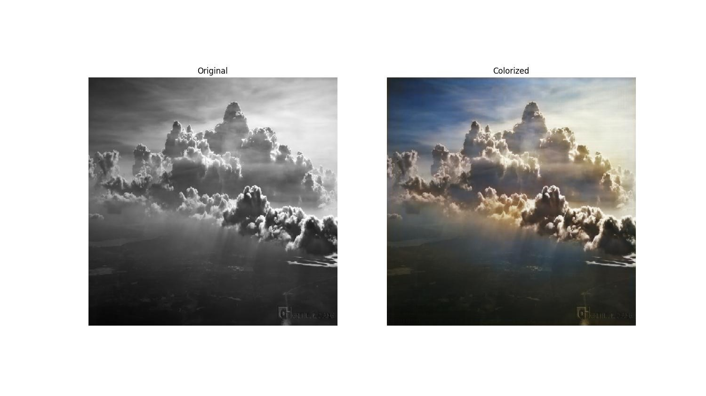

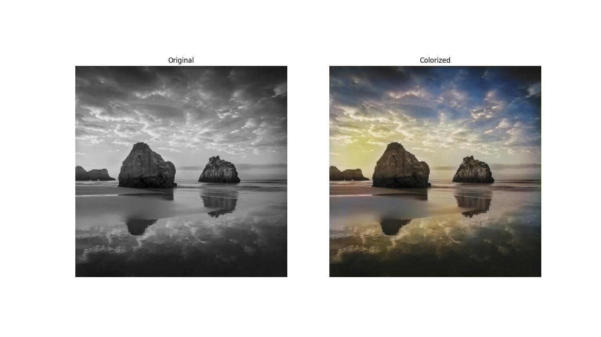

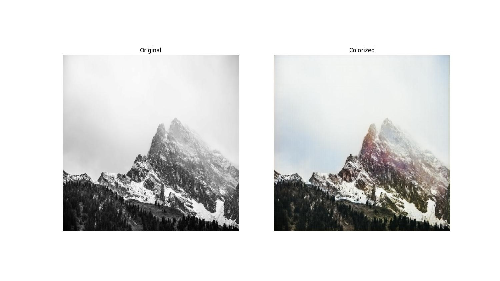

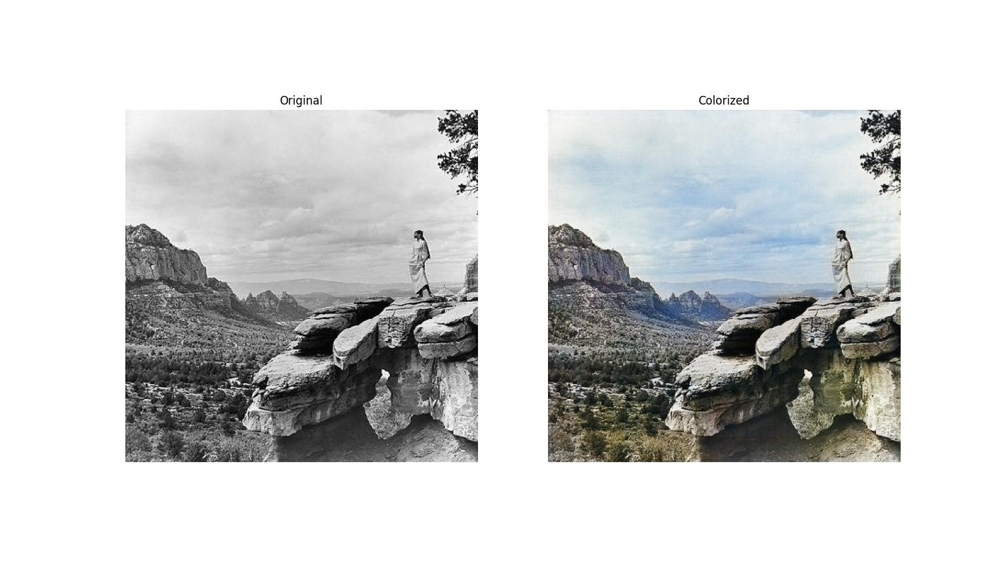

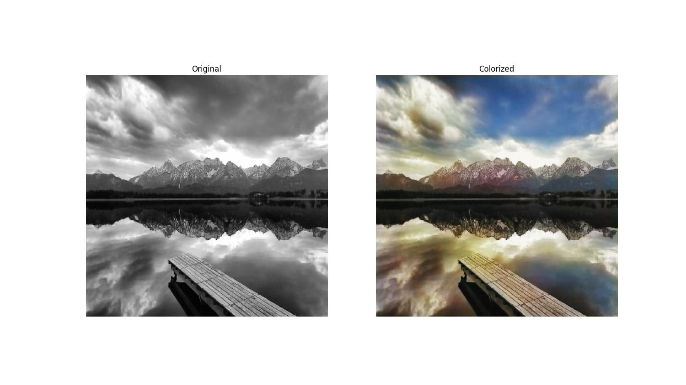

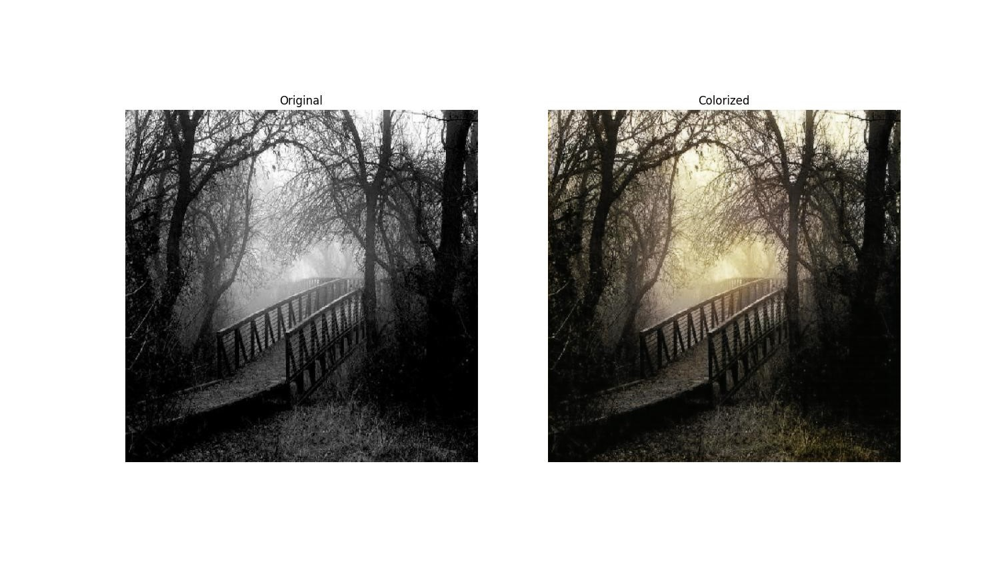

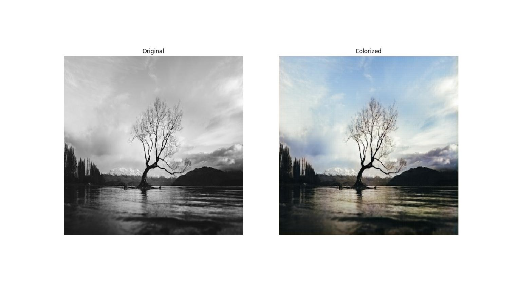

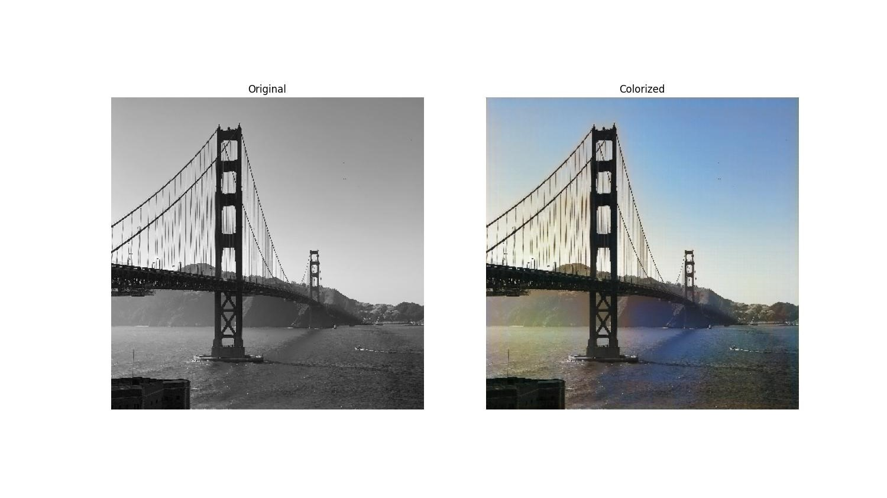

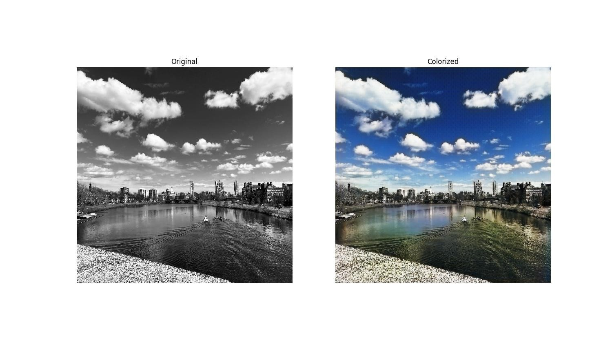

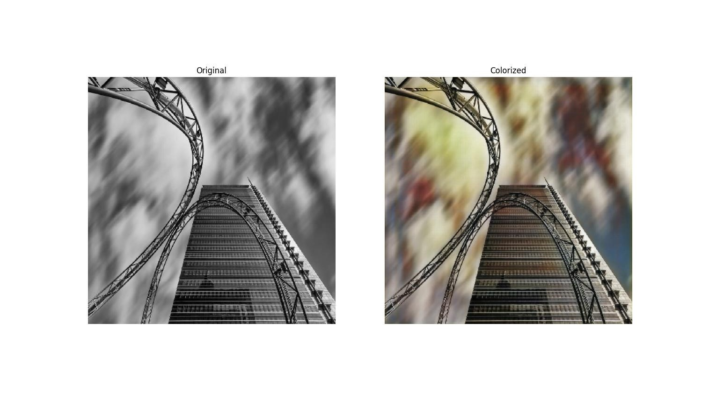

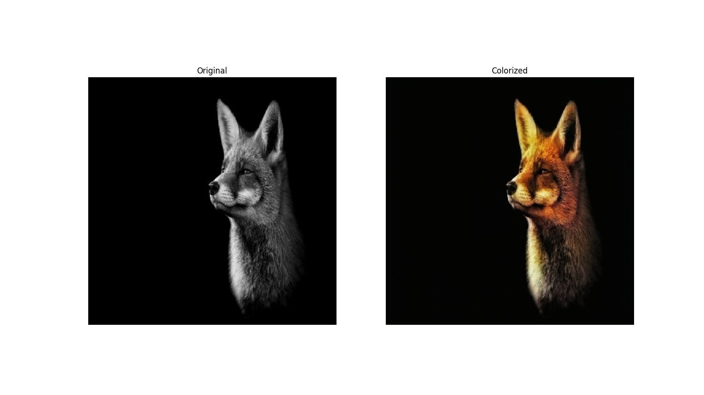
